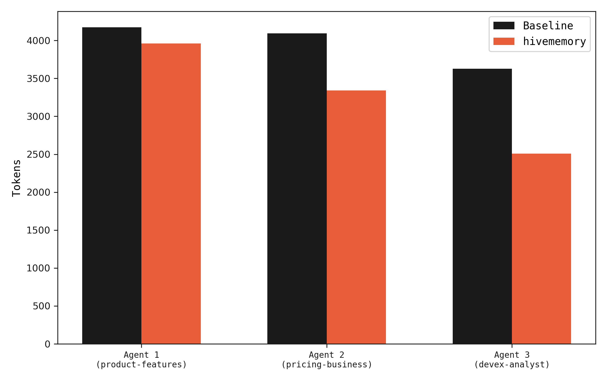
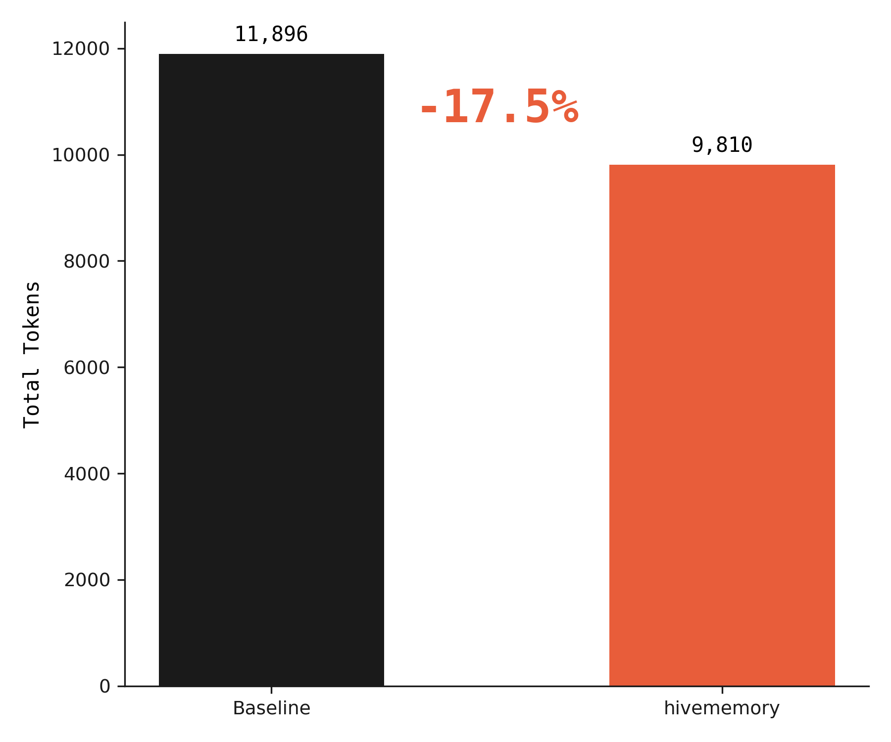
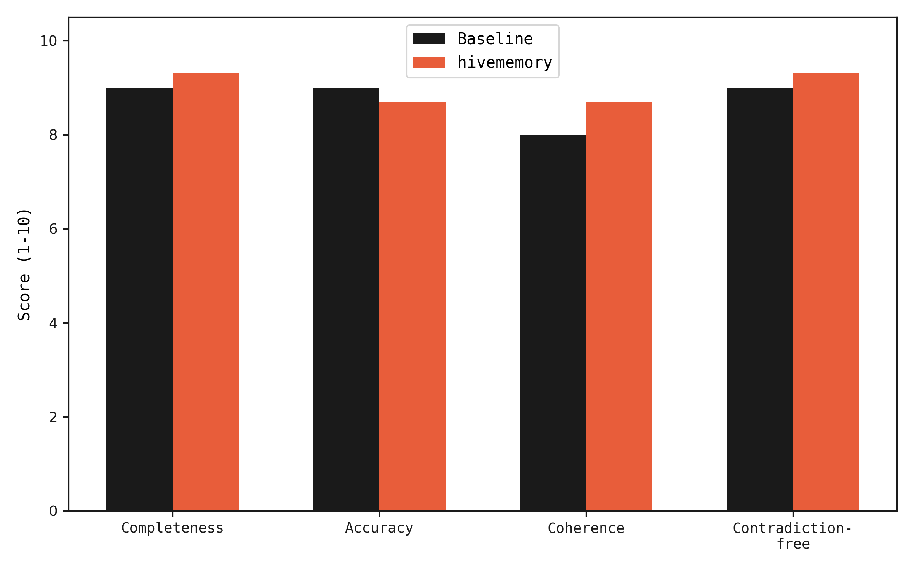
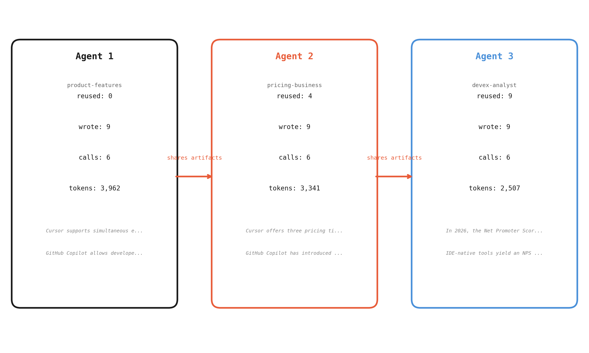
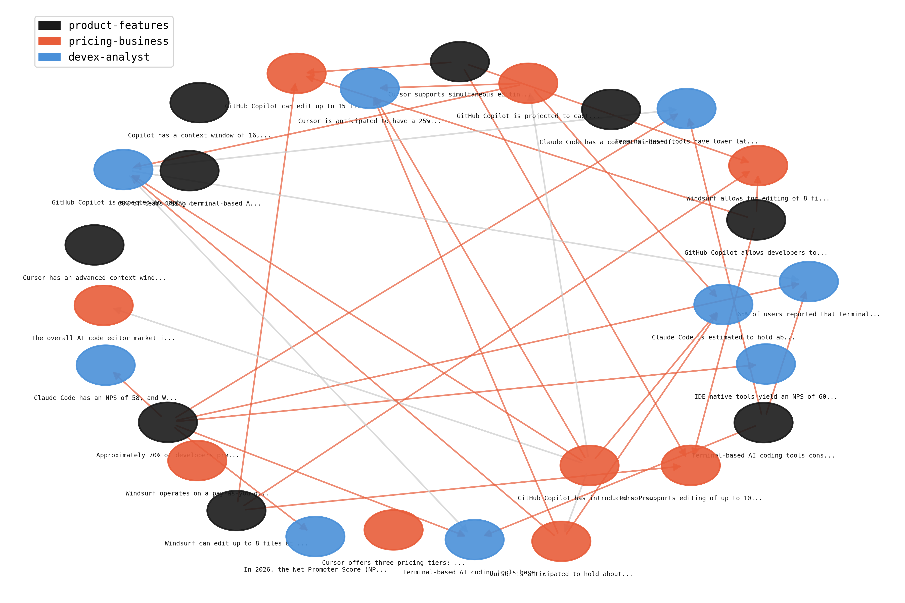
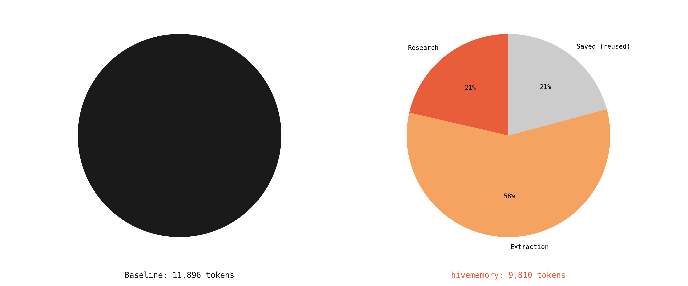

# hivememory

Shared reasoning memory for multi-agent systems.

When multiple AI agents research the same problem independently, they waste tokens re-deriving the same knowledge and produce contradictory conclusions no one catches. hivememory gives agents a shared memory layer where they store structured reasoning artifacts, reuse each other's work, and surface contradictions automatically.

Project page: https://ridxm.github.io/hivememory/

## Results

Benchmark: 3 agents research "Competitive Landscape of AI Code Editors in 2026" using gpt-4o-mini, with and without shared memory. Each agent researches 3 sub-topics. In the shared configuration, agents query hivememory before each LLM call — when prior findings exist, the agent receives a focused prompt that avoids redundant research.

| Metric | Baseline (no shared memory) | hivememory |
|---|---|---|
| Total tokens consumed | 11,896 | 9,810 (-17.5%) |
| Memory-augmented queries | 0 / 9 | 5 / 9 |
| Output quality (LLM-as-judge, avg 3 runs) | 8.8 | 9.0 |
| Contradiction-free score | 9.0 | 9.3 |
| Reuse rate | 0% | 56% |
| Wall clock time | 113.5s | 101.9s |

Token savings come from agents 2 and 3 receiving memory context that produces shorter, non-redundant LLM responses. Quality is equal or slightly better because memory-augmented agents build on verified findings rather than re-deriving from scratch.


*Agents 2 and 3 use fewer tokens when prior findings are available in memory.*




*LLM-as-judge scores across 4 dimensions, averaged over 3 evaluation runs.*

## Architecture

```
  agent-1 ──┐                          ┌── conflict detection
  agent-2 ──┼── hivememory API ────────┼── embedding search (FAISS)
  agent-3 ──┘    write / query /       └── provenance DAG
                 resolve / export
                       │
                 ┌─────┴─────┐
                 │  sqlite   │
                 │  + FAISS  │
                 │   index   │
                 └───────────┘
```


*How artifacts flow between agents. Agent 1 writes findings; agents 2 and 3 query memory, reuse relevant work, and focus on gaps.*


*Dependency graph of artifacts. Colors indicate source agent. Edges show "built on" relationships.*

## Quickstart

```bash
pip install hivememory
```

```python
from hivememory import HiveMemory, Evidence

hive = HiveMemory()

# store a finding
art = hive.write(
    claim="Voice AI market projected to reach $50B by 2028",
    evidence=[Evidence(source="industry report", content="35% CAGR", reliability=0.9)],
    confidence=0.85,
    agent_id="researcher-1",
)

# query shared memory before doing new research
existing = hive.query("voice AI market size", top_k=3)

# check for contradictions
open_conflicts = hive.get_conflicts()

# resolve
if open_conflicts:
    hive.resolve_conflict(open_conflicts[0].id, winner_id=art.id,
                          reason="stronger evidence", resolved_by="supervisor")
```

## How it works

### Reasoning artifacts

Agents store structured claims with evidence, confidence scores, and provenance links — not raw text. Each artifact records who produced it, what evidence supports it, and which prior artifacts it builds on. This structure makes artifacts queryable, comparable, and auditable.

### Conflict detection

When a new artifact is stored, hivememory computes its embedding and searches FAISS for similar existing claims. If two artifacts are semantically close but have divergent confidence scores, a conflict is flagged. This first stage can be followed by an LLM contradiction check (OpenAI or Anthropic) for higher-precision detection.

### Provenance tracking

Every artifact records its dependencies as a list of artifact IDs, forming a directed acyclic graph. This DAG answers "which agent's work did this conclusion build on?" and enables cascading invalidation — if an upstream artifact is superseded, downstream consumers can be notified.

## Repo structure

```
hivememory/
  __init__.py          # public API exports
  artifact.py          # ReasoningArtifact, Evidence, Conflict dataclasses
  core.py              # HiveMemory main class (FAISS + sqlite)
  store.py             # low-level persistence layer
  conflicts.py         # ConflictDetector with LLM client support
  provenance.py        # ProvenanceTracker DAG
  wiki.py              # WikiExporter — markdown knowledge base export
examples/
  basic_usage.py       # store, query, conflict detect, resolve, export
  research_task.py     # 3-agent research demo with full pipeline
benchmarks/
  real_benchmark.py    # real LLM benchmark (gpt-4o-mini)
  generate_charts.py   # generate all charts from results.json
  results.json         # raw benchmark data
  results_summary.md   # human-readable summary
tests/
  test_artifact.py     # artifact serialization and ID generation
  test_store.py        # persistence layer tests
  test_conflicts.py    # conflict detection tests
  test_provenance.py   # provenance DAG tests
```

## Examples

- `python examples/basic_usage.py` — store artifacts, query memory, detect and resolve conflicts, export a wiki. Good first run to verify installation.
- `python examples/research_task.py` — three agents research AI code editors, sharing findings through hivememory. Shows artifact reuse, conflict detection, provenance tracking, and wiki export end-to-end.


*Where tokens go: baseline is all original research. hivememory splits tokens between original research, focused (memory-augmented) queries, and extraction.*

## Setup

- Python 3.10+
- `pip install hivememory`
- Set `OPENAI_API_KEY` for LLM-based conflict detection (optional -- embedding-based detection works without it)
- Run `python examples/basic_usage.py` to verify

## Related work

- Yu et al., ["Multi-Agent Memory from a Computer Architecture Perspective: Visions and Challenges Ahead,"](https://arxiv.org/abs/2603.10062) March 2026. Applies computer architecture principles to multi-agent LLM memory, proposing a three-layer memory hierarchy and identifying gaps in cache sharing and memory access control.
- Karpathy, "LLM Knowledge Bases" (blog post, 2025). Demonstrates single-agent knowledge accumulation with structured retrieval. hivememory extends this pattern to multi-agent systems, adding conflict detection and provenance tracking across agents.

Single-agent knowledge bases work. hivememory makes them multi-agent.

---

MIT License
